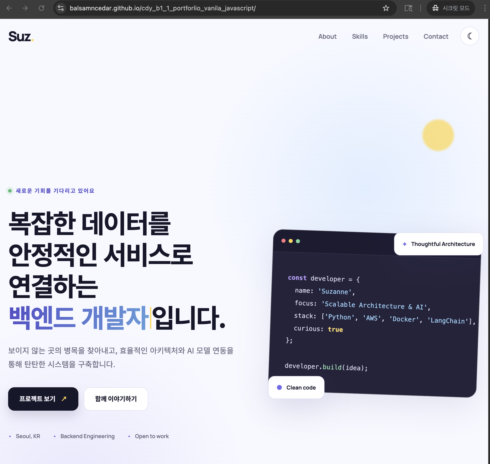
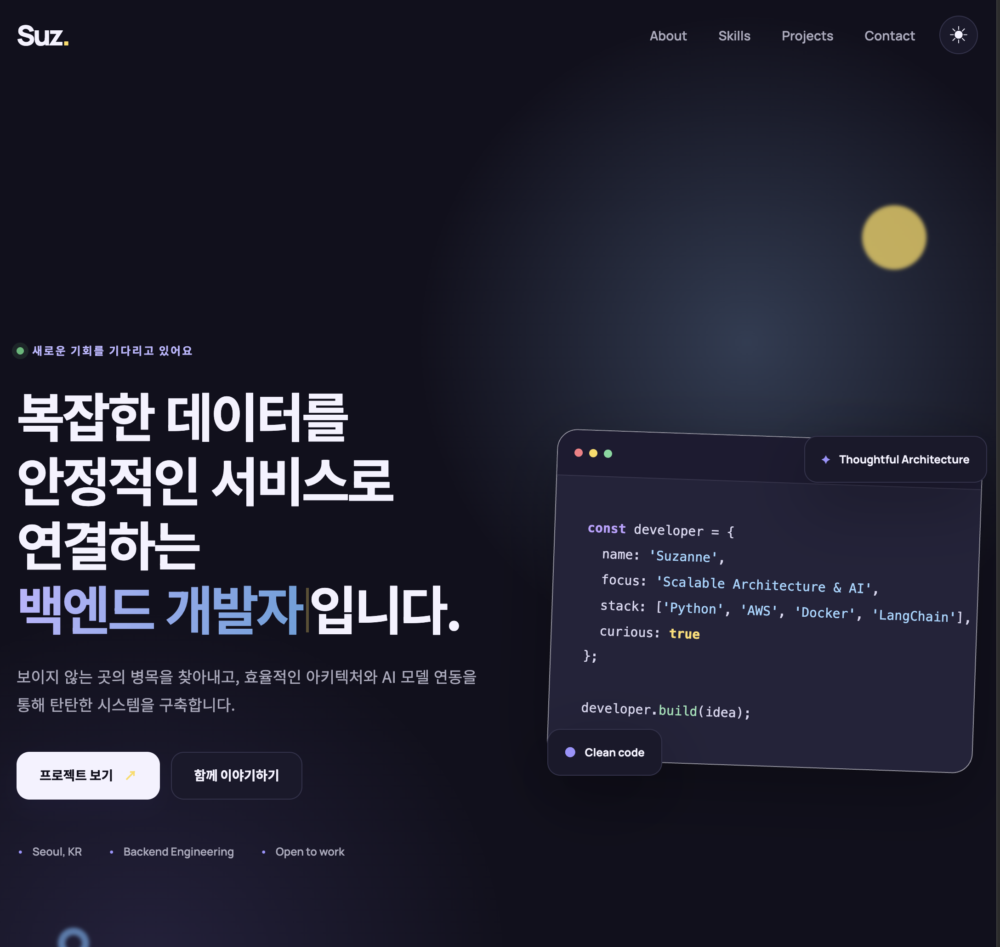
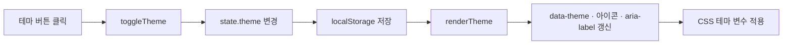

# Suz — Backend & AI Engineer Portfolio

HTML, CSS, Vanilla JavaScript로 만든 개인 포트폴리오입니다. 소개·기술·GitHub 프로젝트·문의 폼을 한 페이지에 담았습니다. 별도 빌드 없이 실행할 수 있으며, **이벤트 → 상태 변경 → 화면 업데이트** 흐름을 코드로 복습할 수 있는 프로젝트입니다.

[포트폴리오 보기](https://balsamncedar.github.io/cdy_b1_1_portforlio_vanila_javascript/) · [저장소](https://github.com/balsamncedar/cdy_b1_1_portforlio_vanila_javascript)

## 미리보기

| 라이트 모드 | 다크 모드 |
| --- | --- |
|  |  |

기존 데스크톱 화면 캡처입니다. 이미지를 클릭하면 크게 볼 수 있습니다.

## 읽는 순서

- **가져다 쓰려면:** [빠른 시작](#quick-start) → [내 정보로 바꾸기](#customize)
- **구현을 이해하려면:** [구조와 설계](#architecture) → [기능별 코드 흐름](#flows)
- **복습하거나 설명하려면:** [개념 요약](#concepts) → [리뷰 질문](#review)
- **수정 후 확인하려면:** [동작 확인](#checks) → [현재 한계](#limitations)

## 주요 기능

| 기능 | 현재 구현 |
| --- | --- |
| 반응형 | 모바일 기본 스타일에 `min-width: 768px`, `1024px`로 확장 |
| 테마 | 다크·라이트 전환, 저장값 우선 복원, 저장값이 없으면 시스템 설정 확인 |
| 탐색 | 햄버거 메뉴, 현재 섹션 강조, 스크롤 헤더, 맨 위로 이동 |
| 애니메이션 | Intersection Observer 등장 효과, 첫 화면 타이핑 효과 |
| 프로젝트 | GitHub 공개 저장소 조회, fork 제외, 언어별 필터, 로딩·오류·빈 결과 UI |
| 문의 | 입력 중 검증, EmailJS 전송, 중복 제출 방지, 성공·실패 피드백 |
| 접근성 | 본문 바로가기, 시맨틱 태그, 폼 label, 메뉴 상태 안내, 모션 감소 설정 일부 지원 |

프레임워크와 빌드 도구는 사용하지 않습니다. 외부 연결은 **GitHub REST API**, **EmailJS Browser SDK v4(CDN)**, **Google Fonts**를 사용합니다.

<a id="quick-start"></a>

## 1. 빠른 시작

```bash
git clone https://github.com/balsamncedar/cdy_b1_1_portforlio_vanila_javascript.git
cd cdy_b1_1_portforlio_vanila_javascript
python3 -m http.server 5500
```

브라우저에서 `http://localhost:5500`을 엽니다. Python 3가 없다면 VS Code의 Live Server 등 정적 서버로 실행해도 됩니다. `npm install`이나 빌드 과정은 없습니다.

- 로컬에서도 GitHub API에 **실제 요청**을 보냅니다. 기본 조회 계정은 `octocat`입니다.
- GitHub 데이터, 외부 폰트, 이메일 전송에는 인터넷 연결이 필요합니다.
- 문의 폼에는 기존 작성자의 EmailJS 설정이 들어 있습니다. **본인의 설정으로 교체한 뒤 전송을 테스트하세요.**

<a id="customize"></a>

## 2. 내 정보로 바꾸기

| 바꿀 내용 | 수정할 위치 | 찾을 키워드 |
| --- | --- | --- |
| 페이지 제목·검색 설명 | [index.html](index.html) | `title`, `description` |
| 이름·소개·기술·연락처 | [index.html](index.html) | `hero`, `about`, `skills`, `contact` |
| 프로필 이미지 | [images/profile.svg](images/profile.svg), [index.html](index.html) | `profile.svg`, `alt` |
| 이메일·소셜 링크 | [index.html](index.html) | `mailto:`, `social-links` |
| 색상·폰트·간격 | [css/style.css](css/style.css) | `:root`, `[data-theme="dark"]` |
| GitHub 조회 계정 | [js/app.js](js/app.js) | `githubUsername` |
| 이메일 전송 설정 | [js/app.js](js/app.js) | `EMAIL_CONFIG` |

### GitHub 프로젝트 설정

현재 `githubUsername`은 실행 주소에 따라 결정됩니다.

| 실행 환경 | 조회 계정 |
| --- | --- |
| `{username}.github.io` | 호스트 이름의 첫 부분인 `username` |
| localhost 또는 커스텀 도메인 | 기본값 `octocat` |

환경과 관계없이 내 저장소를 표시하려면 기존 `githubUsername` 선언 전체를 아래처럼 교체합니다.

```js
const githubUsername = 'YOUR_GITHUB_USERNAME';
```

요청 주소는 `https://api.github.com/users/{username}/repos?sort=updated&per_page=9`입니다. 업데이트 순으로 최대 9개를 받아 **그중 fork 저장소를 제외**하므로 카드가 9개보다 적을 수 있습니다. 언어 필터 역시 받아온 데이터만 대상으로 합니다.

`octocat`은 오프라인 샘플 데이터가 아니라 기본 조회 계정입니다. 요청이 실패하면 샘플 카드 대신 오류와 재시도 버튼을 표시합니다.

### EmailJS 문의 폼 설정

1. 본인의 EmailJS 계정에서 이메일 서비스와 템플릿을 준비합니다.
2. `js/app.js`의 `EMAIL_CONFIG` 값을 교체합니다.
3. 템플릿의 수신자를 설정하고, 폼 필드와 템플릿 변수를 맞춥니다.

```js
const EMAIL_CONFIG = {
  publicKey: 'YOUR_PUBLIC_KEY',
  serviceId: 'YOUR_SERVICE_ID',
  templateId: 'YOUR_TEMPLATE_ID'
};
```

| 폼의 `name` 속성 | 템플릿 변수 | 내용 |
| --- | --- | --- |
| `name` | `{{name}}` | 작성자 이름 |
| `email` | `{{email}}` | 답장받을 이메일 |
| `message` | `{{message}}` | 문의 내용 |

`sendForm()`은 폼의 `name` 속성을 기준으로 값을 템플릿에 전달합니다. 필드 이름을 바꿀 때는 템플릿과 `validationRules`, 오류 요소 ID도 함께 맞춰야 합니다. 연결 방식은 [EmailJS 공식 sendForm 문서](https://www.emailjs.com/docs/sdk/send-form/)를 참고하세요.

현재 코드는 SDK 전송 성공 응답을 받은 뒤에만 폼을 비웁니다. 실패하면 입력값을 유지합니다. 실제 수신 여부는 본인의 설정으로 테스트해 확인해야 합니다.

### 정적 사이트 배포

이 저장소는 루트의 `index.html`을 제공하는 정적 호스팅에 배포할 수 있습니다. 별도 빌드 결과물은 없습니다. GitHub Pages를 사용할 경우 배포할 브랜치의 루트를 게시 대상으로 지정합니다. 포크한 저장소에서는 이 문서 상단의 포트폴리오·저장소 링크도 본인의 주소로 변경하세요.

<a id="architecture"></a>

## 3. 구조와 설계

```text
.
├── index.html       # 콘텐츠, 시맨틱 구조, 폼, 외부 파일 연결
├── css/
│   └── style.css    # 공통 변수, 테마, 컴포넌트, 반응형, 애니메이션
├── js/
│   └── app.js       # 상태, 이벤트, DOM 갱신, API 요청, 폼 처리
└── images/          # 프로필 일러스트와 화면 캡처
```

**관심사 분리**는 변경 목적이 다른 코드를 나누는 것입니다. 소개 문구는 HTML, 색상은 CSS, 검증 조건은 JavaScript에서 수정합니다. HTML은 `defer`로 스크립트를 연결해 문서 파싱 후 실행하도록 합니다.

JavaScript의 역할은 다음과 같이 나뉩니다.

| 구분 | 역할 | 예시 |
| --- | --- | --- |
| 상태 | 현재 UI를 결정하는 데이터 | `state.theme`, `state.projects` |
| DOM 참조 | 수정할 HTML 요소를 찾아 보관 | `elements.themeToggle`, `elements.form` |
| 이벤트 처리 | 입력에 반응하고 상태를 변경 | `toggleTheme()`, `toggleMenu()` |
| 렌더링 | 현재 값을 읽어 화면을 갱신 | `renderTheme()`, `renderProjectState()` |
| 외부 작업 | 데이터를 요청하거나 전송 | `fetchProjects()`, `handleSubmit()` |

```js
const state = {
  theme: 'light',
  menuOpen: false,
  projects: [],
  projectStatus: 'idle',
  activeFilter: 'All'
};
```

개별 변수로 구현할 수도 있지만, 관련 상태를 모으면 화면이 무엇에 의해 결정되는지 찾기 쉽습니다. `const`는 객체 재할당을 막을 뿐 속성 변경을 막지는 않습니다. 또한 **일반 객체이므로 값을 바꾼 뒤 렌더 함수를 직접 호출해야 합니다.**

모든 상태가 이 객체에 있는 것은 아닙니다. 폼의 전송 여부는 별도 `isSubmitting` 변수로, 입력값은 폼 요소에서 관리합니다.

<a id="flows"></a>

## 4. 기능별 코드 흐름

### 테마: 이벤트 → 상태 → 화면



- `getInitialTheme()`: 저장된 `portfolio-theme`을 우선 사용하고, 없으면 시스템의 다크 모드 선호 설정을 확인합니다.
- `toggleTheme()`: 테마 상태를 반전시키고 저장합니다.
- `renderTheme()`: `<html>`의 `data-theme`과 버튼 UI를 변경합니다.

**기억할 점:** `state`는 현재 페이지의 값, `localStorage`는 새로고침 후 복원할 값입니다. 시스템 설정을 실시간으로 계속 추적하는 구현은 아닙니다.

### GitHub API: 비동기 요청과 화면 분기

```text
fetchProjects()
  → loading 설정 + 로딩 UI 표시
  → await fetch()
  → response.ok 검사: HTTP 실패는 직접 throw
  → await response.json()
  → fork 제외 + 데이터 저장 + success 설정
  → 필터 버튼과 프로젝트 목록 렌더링

요청·응답 처리 중 예외
  → catch에서 error 설정
  → 오류 UI와 다시 시도 버튼 표시
```

| 화면 상태 | 판단 기준 | 표시 |
| --- | --- | --- |
| 로딩 | `projectStatus === 'loading'` | 스켈레톤, 스피너, 안내 문구 |
| 오류 | `projectStatus === 'error'` | 오류 문구, 재시도 버튼 |
| 빈 결과 | 필터링된 배열의 길이가 0 | 빈 결과 안내 |
| 데이터 있음 | 필터링된 배열의 길이가 1 이상 | 프로젝트 카드 |

빈 결과는 별도 `'empty'` 상태값으로 저장하지 않고 배열 길이로 계산합니다.

**기억할 점:** `fetch()`는 404·500 같은 HTTP 응답만으로 자동으로 예외를 던지지 않습니다. `response.ok` 검사와 `throw`가 있어야 현재 코드의 `catch`로 연결됩니다. `await`는 해당 비동기 함수의 진행을 기다리게 하며 브라우저 전체를 멈추지 않습니다.

### 배열 데이터 → 카드 UI

```text
저장소 배열
  → filter: fork 제외
  → state.projects에 저장
  → filter: 선택한 언어만 선택(All이면 전체)
  → map: 저장소 객체를 카드 HTML 문자열로 변환
  → join(''): 문자열 배열을 하나로 연결
  → innerHTML: 프로젝트 영역 갱신
```

필터 버튼은 아래 순서로 만듭니다.

```js
const languages = [
  'All',
  ...new Set(state.projects.map(({ language }) => language).filter(Boolean))
];
```

`map`으로 언어를 추출하고, `filter(Boolean)`으로 빈 값을 제거하고, `Set`으로 중복을 제거합니다. 카드의 이름·설명 등은 `escapeHtml()`로 특수문자를 치환한 뒤 HTML 문자열에 넣습니다.

### 문의 폼: 검증 → 전송 → 복구

| 필드 | 검사 기준 |
| --- | --- |
| 이름 | 앞뒤 공백 제거 후 2글자 이상 |
| 이메일 | 정규식으로 기본 형식 검사 |
| 메시지 | 앞뒤 공백 제거 후 10글자 이상 |

```text
input 이벤트 → validateField() → 오류 문구·invalid 클래스·aria-invalid 변경

submit 이벤트 → 기본 제출 방지 → 중복 제출 확인 → 모든 필드 검사
  ├─ 유효하지 않음: 첫 오류 필드에 포커스
  ├─ SDK 없음: 로딩 실패 안내
  └─ 유효함: 버튼 비활성화 + 입력 읽기 전용 + EmailJS 전송
       ├─ 성공: 성공 문구 + 폼 초기화
       ├─ 실패: 오류 문구 + 입력 유지
       └─ finally: 버튼·입력·isSubmitting 복구
```

`fields.map(validateField).every(Boolean)`은 **모든 필드를 먼저 검사한 뒤** 전체 성공 여부를 판단합니다. `fields.every(validateField)`로 바꾸면 첫 실패에서 검사가 멈춰 뒤쪽 필드의 오류 표시가 빠질 수 있습니다.

`novalidate`로 브라우저 기본 제출 검증을 끄고 직접 피드백을 제공합니다. 이메일 정규식은 형식을 검사할 뿐 실제 존재하는 주소인지는 확인하지 않습니다.

### 메뉴와 스크롤

| 동작 | 함수·API | 기준 |
| --- | --- | --- |
| 메뉴 열기·닫기 | `toggleMenu()`, `renderMenu()` | `menuOpen`에 따라 클래스와 `aria-expanded` 갱신 |
| 메뉴 링크 선택 | `closeMenu()` | 이동 시 모바일 메뉴 닫기 |
| 헤더 스타일 | `handleScroll()` | `scrollY >= 60` |
| 맨 위로 버튼 표시 | `handleScroll()` | `scrollY >= 300` |
| 최상단 이동 | `window.scrollTo()` | 클릭 시 `top: 0`, `behavior: 'smooth'` |
| 등장 효과 | `IntersectionObserver` | `threshold: 0.2`, 진입 시 표시 후 관찰 해제 |

<a id="concepts"></a>

## 5. 개념 요약 — 왜 이렇게 작성했나?

| 개념 | 뜻 | 이 프로젝트에서의 선택 |
| --- | --- | --- |
| 시맨틱 HTML | 콘텐츠의 의미를 나타내는 태그 | 주요 탐색은 `nav`, 중심 본문은 `main`, 주제별 영역은 `section`, 독립 카드에는 `article` |
| DOM | 브라우저가 HTML을 객체로 표현한 구조 | `querySelector`로 요소를 찾고 `classList`, `textContent`, `dataset` 등으로 갱신 |
| CSS 변수 | 반복되는 스타일 값을 이름으로 관리 | 색상·폰트·간격을 `:root`에 정의하고 다크 테마에서 일부 재정의 |
| 이벤트 리스너 | 특정 동작에 반응할 함수 등록 | 인라인 `onclick` 대신 `addEventListener`로 HTML과 동작 연결 코드를 분리 |
| Flexbox | 한 축 중심으로 정렬·공간 배분 | 내비게이션, 버튼, 태그, 카드 내부 세로 배치 |
| Grid | 행·열 구조를 정의하는 배치 | 주요 섹션, 스킬 목록, 프로젝트 목록 |
| 모바일 퍼스트 | 작은 화면을 기본으로 큰 화면에서 확장 | 기본 1열·모바일 메뉴에서 `min-width`로 확장 |
| Promise·async/await | 비동기 작업의 결과와 순서를 표현 | GitHub 응답과 이메일 전송 결과를 기다림 |
| try/catch/finally | 실행·예외 처리·공통 마무리 | API 오류 처리, 폼 전송 후 입력과 버튼 복구 |

### 반응형에서 기억할 두 가지

**1. 큰 영역은 미디어 쿼리로 전환합니다.**

| 너비 | 배치 |
| --- | --- |
| 768px 미만 | 주요 영역 1열, 햄버거 메뉴, 세로 버튼·입력 폼 |
| 768px 이상 | 주요 영역 2열, 스킬 3열, 가로 내비게이션 |
| 1024px 이상 | 소개·연락처 등 주요 영역의 간격 확대 |

**2. 프로젝트 카드는 컨테이너 공간에 따라 자동 배치합니다.**

```css
.project-grid {
  display: grid;
  grid-template-columns: repeat(auto-fit, minmax(min(100%, 300px), 1fr));
}
```

`min(100%, 300px)`은 좁은 화면에서 최소 너비가 컨테이너를 넘지 않게 합니다. `minmax(..., 1fr)`은 남는 공간을 분배하고, `auto-fit`은 들어갈 수 있는 열을 배치하며 빈 열을 접습니다. 따라서 프로젝트 열 수를 특정 화면 너비에서 무조건 1·2·3열로 고정한 구조는 아닙니다.

<a id="review"></a>

## 6. 복습·코드리뷰 질문

답변을 가리고 먼저 설명해 본 뒤, 관련 함수를 찾아 흐름을 따라가면 좋습니다.

| 질문 | 짧은 답변 | 찾아볼 코드 |
| --- | --- | --- |
| 왜 파일을 분리했나요? | 구조·표현·동작의 변경 위치를 명확히 하려고 나눴습니다. | HTML의 `link`, `script` |
| 왜 상태 객체를 썼나요? | 주요 UI 데이터를 모아 파악하기 쉽게 했습니다. 개별 변수도 가능합니다. | `state`, `renderTheme` |
| 상태를 바꾸면 자동 렌더링되나요? | 아닙니다. 일반 객체이므로 렌더 함수를 직접 호출합니다. | `toggleTheme` |
| 새로고침 후 테마는 어떻게 유지되나요? | localStorage의 값을 초기화 때 읽어 다시 적용합니다. | `getInitialTheme` |
| 오류 응답은 왜 직접 throw하나요? | fetch가 HTTP 오류 상태만으로 reject하지 않기 때문입니다. | `fetchProjects` |
| filter와 map의 차이는? | filter는 선택, map은 변환입니다. | `renderProjectState` |
| onclick 대신 리스너를 쓴 이유는? | 구조와 동작을 분리하고 여러 리스너와 옵션을 사용할 수 있습니다. | 하단 이벤트 등록부 |
| 모바일 퍼스트의 근거는? | 모바일 기본 스타일에 min-width 조건으로 넓은 화면을 추가했습니다. | CSS 미디어 쿼리 |
| 전송 실패 시 작성 내용은? | 입력은 유지하고 finally에서 조작 가능한 상태로 되돌립니다. | `handleSubmit` |
| 검증할 때 왜 map 다음 every인가요? | 첫 오류에서 멈추지 않고 모든 필드의 피드백을 갱신하기 위해서입니다. | `handleSubmit` |

<a id="checks"></a>

## 7. 수정 후 동작 확인

아래는 수동 확인 절차이며, 자동 테스트 통과 기록이 아닙니다.

| 확인할 동작 | 방법 | 기대 결과 |
| --- | --- | --- |
| 반응형 | 375px, 767px, 768px, 1024px 등으로 너비 변경 | 메뉴·주요 배치 전환, 가로 넘침 확인 |
| 테마 유지 | 테마 전환 후 같은 주소에서 새로고침 | 선택한 테마 복원 |
| 모바일 메뉴 | 열기 → 메뉴 링크 클릭 | 섹션 이동 후 메뉴 닫힘 |
| 스크롤 | 아래로 이동 후 맨 위로 버튼 클릭 | 등장 효과, 버튼 표시, 최상단 이동 |
| API 로딩 | 개발자 도구 Network에서 느린 연결 적용 후 새로고침 | 로딩 UI 후 카드 표시 |
| API 오류·복구 | GitHub API 요청 차단 후 새로고침 → 차단 해제 → 재시도 | 오류 UI 후 정상 복구 |
| 빈 결과 | Console에서 `state.projects = []; state.projectStatus = 'success'; renderProjectState();` 실행 | 빈 결과 안내, 새로고침으로 복원 |
| 폼 검증 | 빈 폼 제출, 잘못된 이메일 입력 | 오류 문구와 첫 오류 필드 포커스 |
| 메일 성공·실패 | 본인 EmailJS 설정 후 전송, 요청 차단으로 실패도 확인 | 성공 시 초기화, 실패 시 입력 유지 |
| 전송 중 조작 | 느린 연결에서 제출 | 버튼 비활성화, 입력 읽기 전용, 완료 후 복구 |

<a id="limitations"></a>

## 8. 현재 한계와 다음 개선

- **API 범위:** 최근 최대 9개를 받은 뒤 fork를 제외합니다. 전체 저장소 페이지네이션과 캐시는 구현하지 않았습니다.
- **테마 저장:** 저장값 검증과 localStorage 접근 예외 처리가 없습니다.
- **상태 안내 접근성:** 프로젝트의 live region은 있지만 실제 로딩·오류 문구는 다른 영역에 렌더링합니다. 필드 오류 문구도 `aria-describedby`로 연결할 여지가 있습니다.
- **모션 감소:** CSS 애니메이션과 타이핑은 대응하지만, 맨 위로 버튼의 JS는 항상 부드러운 스크롤을 요청합니다.
- **메뉴 키보드 조작:** Escape 키로 닫는 동작은 추가하지 않았습니다.
- **폼 전송:** 클라이언트 검증과 중복 제출 방지는 구현되어 있으나, 이것만으로 외부 요청을 통한 우회까지 막지는 않습니다. 재사용 시 본인 EmailJS 설정과 수신 결과를 확인해야 합니다.

복습할 때는 `state` → `toggleTheme()` → `fetchProjects()` → `renderProjectState()` → `handleSubmit()` 순서로 읽으면 상태 관리, 비동기 처리, 화면 갱신을 차례로 따라갈 수 있습니다.
